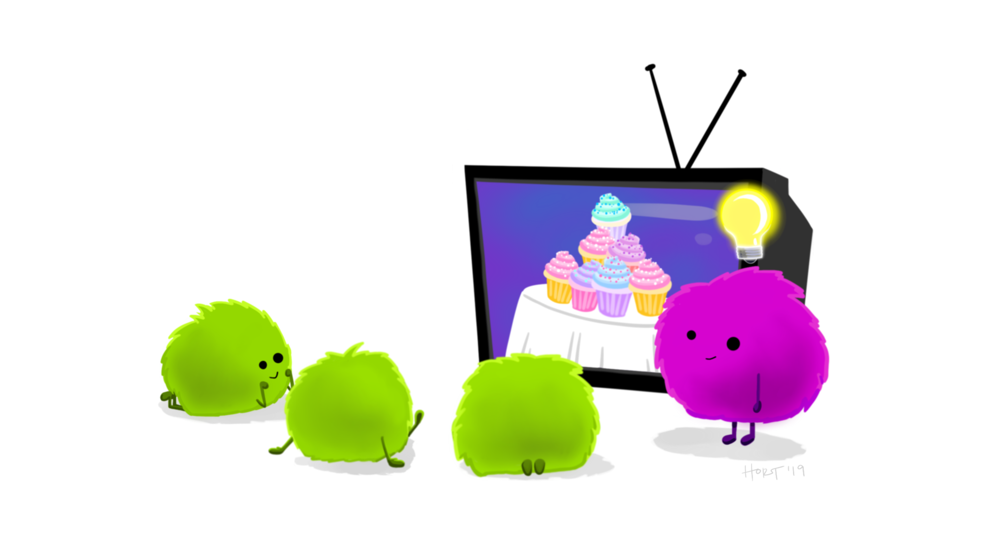
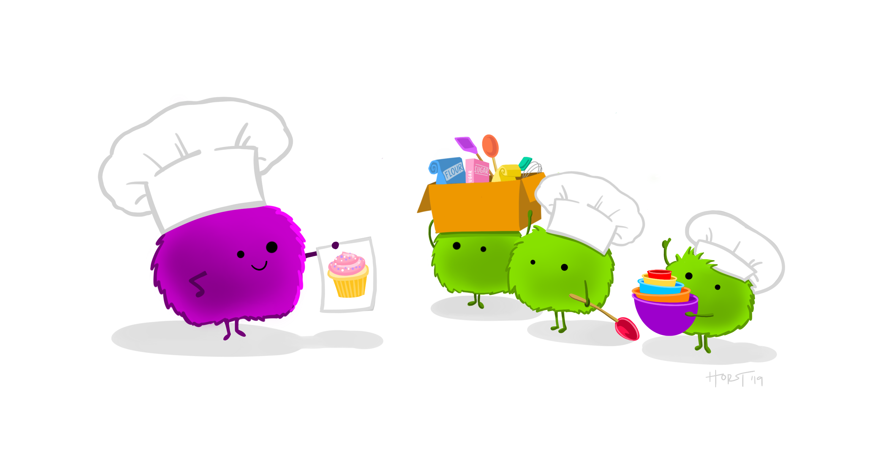
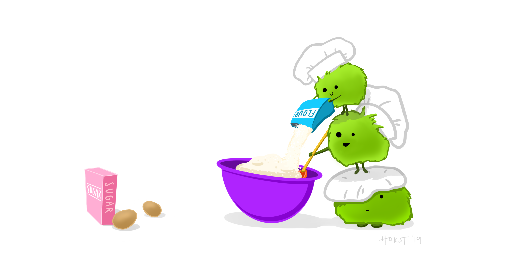

```{r include=FALSE}
library(tidyverse)
library(here)
```

```{r}
# Get details of the working directory

getwd()
```

```{r}
# The package here::here() gives the project location

here::here()
```









